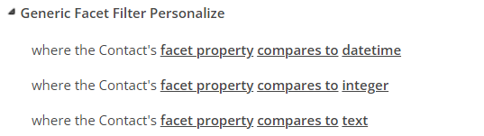
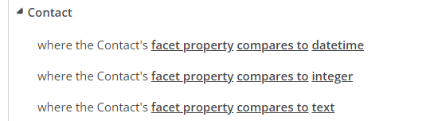
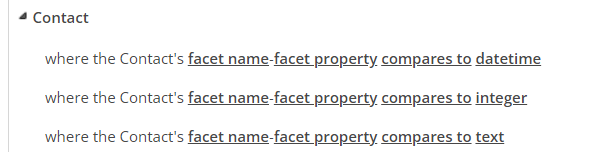
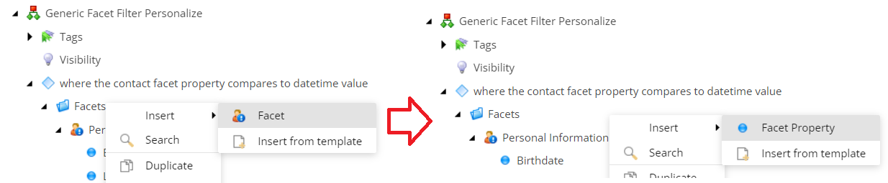

Sitecore - Generic Facet Filters
==============

Summary
--------------
Adds custom rules for Personalization and Segmentation conditions

- Personalization Rules 

- Segmentation Rules - Segment List Conditions 

- Segmentation Rules - Marketing Automation Engine Conditions 

Installation
--------------
Download the package below for your respective Sitecore version

- [Generic Facet Filters](./releases/Etonon.Feature.GenericFacetFilter-1.0.zip) (Tested on Sitecore 9.3 - 10.4)

Install the package by Installation Wizard and Publish the items under the paths:
- /sitecore/templates/Feature/GenericFacetFilter
- /sitecore/system/Settings/Rules/Definitions/Elements/Generic Facet Filter Personalize

For Marketing Automation Engine deployment:
- Copy Etonon.Feature.GenericFacetFilter.dll and .pdb files into the Marketing Automation service folder
- Copy [sc.Etonon.Feature.GenericFacetFilter.Predicates.xml](.\src\Feature\GenericFacetFilter\code\_xConnect_Config\AutomationEngine\Segmentation\sc.Etonon.Feature.GenericFacetFilter.Predicates.xml) into Marketing Automation service config folder

See [here](https://doc.sitecore.com/xp/en/developers/latest/sitecore-experience-platform/create-a-custom-condition-and-segmentation-query.html#configure-the-marketing-automation-engine) in case you need more details.

> ***IMPORTANT NOTE FOR SCALED SETUPS***
For scaled setups, copy the files in the Sitecore package (config and DLLs) to the Sitecore CD servers.

Adding facets
--------------
To add more facets:
- On Content Editor go to /sitecore/system/Settings/Rules/Definitions/Elements;
- Look for the Element Folder you want to include the new facet:
  - Personalize -> /sitecore/system/Settings/Rules/Definitions/Elements/Generic Facet Filter Personalize
  - Segment List -> /sitecore/system/Settings/Rules/Definitions/Elements/Generic Facet Filter Segmentation - Search Query
  - Marketing Automation Engine -> /sitecore/system/Settings/Rules/Definitions/Elements/Generic Facet Filter Segmentation - Condition
- Then right-click on the Facets folder under it, select Insert > Facet, then insert its Facet Properties.

For ***Personalize Conditions*** it needs an extra step to allow Sitecore to get the facet properties from the analytics tracker, to do that configure it on the config file (\App_Config\Include\Feature\Etonon.Feature.GenericFacetFilter.config). 
See [here](https://doc.sitecore.com/xp/en/developers/latest/sitecore-experience-platform/load-facets-into-session.html) in case you need more details.

About
--------------
Eduardo Tonon - Sitecore Developer since 2015 
LinkedIn: [Eduardo Tonon](https://www.linkedin.com/in/eduardotonon/)